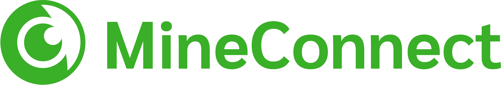

    

    
     </a>
    

   

# Here are some problems other users run into:

## playit.gg 
To use playit.gg with MineConnect you have to set up a custom TCP Tunnel, not a Minecraft Tunnel. You get a new Port. This is the number behind the ':' in your public address. For example, you have the address some-domain.playit.gg:12345 Then you have to use 12345 as Port in the MineConnect App. 

## Still need help? 
Write me an email at info@ibb-games.de! 
But please try to specify your problem as detailed as possible. And provide me information about your device (Android/iOS), how your Server is set up and what service you use to run it, and if you have other plugins installed that do networking their names.